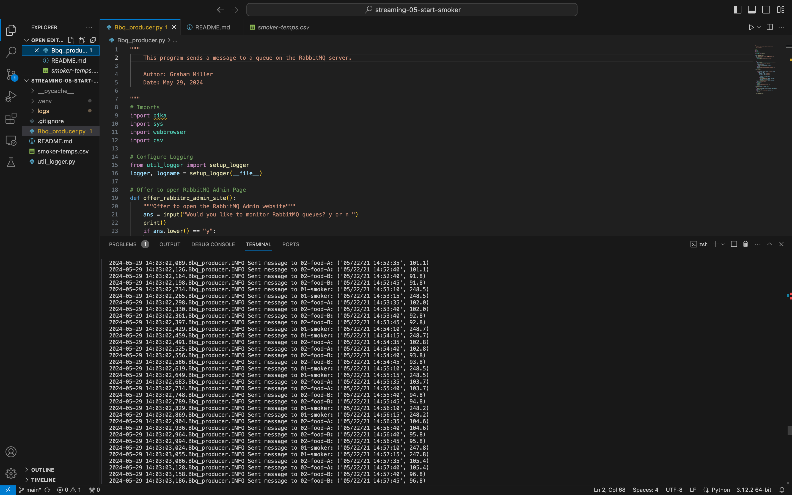
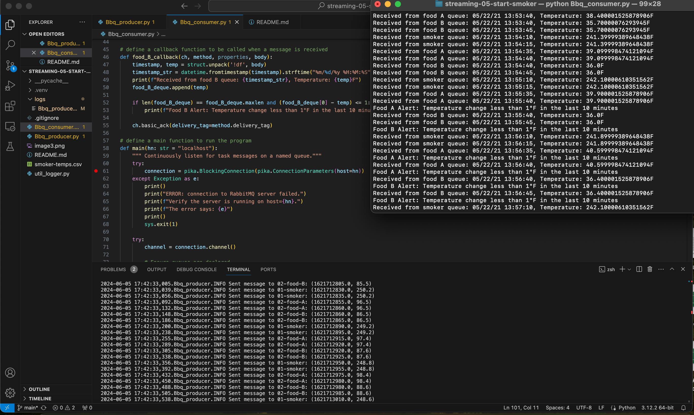
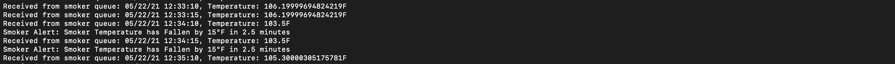
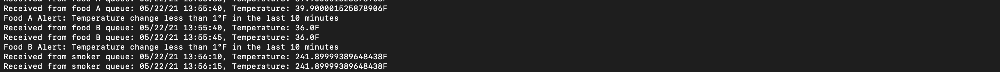

# streaming-05-start-smoker

### Graham Miller
### May 29, 2024

## Project Goal
The goal of the project is to create a producer that proccesses and sends csv data to RabbitMQ for a consumer to monitor and send alerts when certain conditions are met. 

### The Problem / Challenge To Solve
We want to stream information from a smart smoker. Read one value every half minute. (sleep_secs = 30)

smoker-temps.csv has 4 columns:

[0] Time = Date-time stamp for the sensor reading
[1] Channel1 = Smoker Temp --> send to message queue "01-smoker"
[2] Channel2 = Food A Temp --> send to message queue "02-food-A"
[3] Channel3 = Food B Temp --> send to message queue "02-food-B"

### Requirements
- RabbitMQ Server running
- Pika installed in .venv
- Use Module 4 projects as examples

### Task 1. Create a Place to Work
1. In GitHub, create a new repo for your project - name it streaming-05-smart-smoker.
1. Add a README.md during the creation process. (If not, you can always add it later.)
1. Clone your repo down to your machine.
1. In VS Code, add a .gitignore (use one from an earlier module), start working on the README.md. Create it if you didn't earlier.
1. Add the csv data file to your repo.
1. Create a file for your bbq producer.

### Task 2. Design and Implement Your Producer
- Implement your bbq producer. More detailed help provided in links below. 
- Use the logic, approach, and structure from Module 4, version 2 and version 3.
- These provide a current and solid foundation for streaming analytics - modifying them to serve your purpose IS part of the assignment.
- Do not start from scratch - do not search for code - do not use a notebook.
- Use comments in the code and repo to explain your work. 
- Use docstring comments and add your name and date to your README and your code files. 
- Explain your project in the README. Include prerequisites and how to run your code. 
- Document your project works - display screenshots of your console and maybe the RabbitMQ console. 
- If you only have a producer, you won't have a consumer showing messages yet, so you'll need to be creative. We'll build the consumers next.

### Read 
1. To be guided through the producer design, read https://nwmissouri.instructure.com/courses/60464/pages/module-5-dot-1-guided-producer-design?wrap=1 
2. For a bit more guidance on the coding implementation, read https://nwmissouri.instructure.com/courses/60464/pages/module-5-dot-2-guided-producer-implementation?wrap=1

### Producer Code Setup
- Import pika, csv, sys, and webbrowser.
- Add util_logger.py file to the repository and initialize logging .
- Create a function that offers to open RabbitMQ Admin site. 
- Write a function that connects to RabbitMQ, creates 3 queues, and deletes existing queues with the same name. 
- Create a function that establishes a path to the smoker-temps.csv and extracts the desired info from each row.
- Create a send_message function that sends the message to the specified queue. 

## Run the Code
### Create A Virtual Environment 
1. Open a terminal window in VS Code.
1. Use the built-in Python utility venv to create a new virtual environment named `.venv` in the current directory.

```shell
python3 -m venv .venv
```

Verify you get a new .venv directory in your project. 
We use .venv as the name to keep it away from our project files. 

### Activate the Virtual Environment

In the same VS Code terminal window, activate the virtual environment.

- On Linux/MacOS, run: `source .venv/bin/activate`

Verify you see the virtual environment name (.venv) in your terminal prompt.

### Start RabbitMQ Server

On a mac terminal, start the RabbitMQ server.

- On MacOS, run `brew services start rabbitmq`

### Execute the Producer

1. Run the producer in the VS Code terminal 
- Open the terminal in VS Code and run `python Bbq_producer.py` to send the tasks to the RabbitMQ queue



### Consumer
The consumer script listens to the RabbitMQ queue for data from the smoker-temps csv. The consumer is setup to monitor if the smoker temperature drops over 15 degrees in 2.5 minutes, if food A temperature change stalls over a 10 minute period, and if food B temperature stalls over a 10 minute period. 

### Execute the Consumer

1. Run the consumer on either the VS code terminal or the mac terminal
- Open the terminal in either VS code or in the mac terminal and run `python Bbq_consumer.py`



#### Smoker Decrease Image



#### Food A and Food B Stall


 
